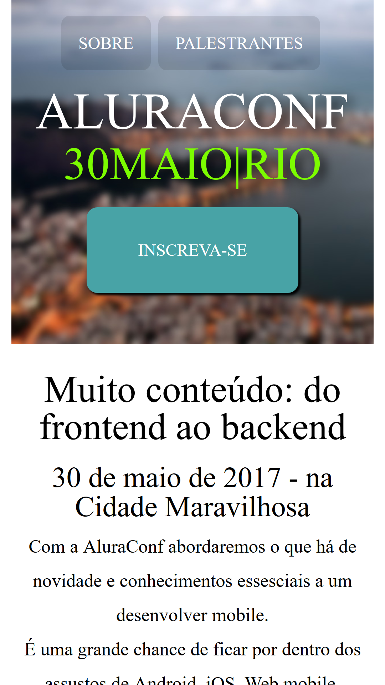
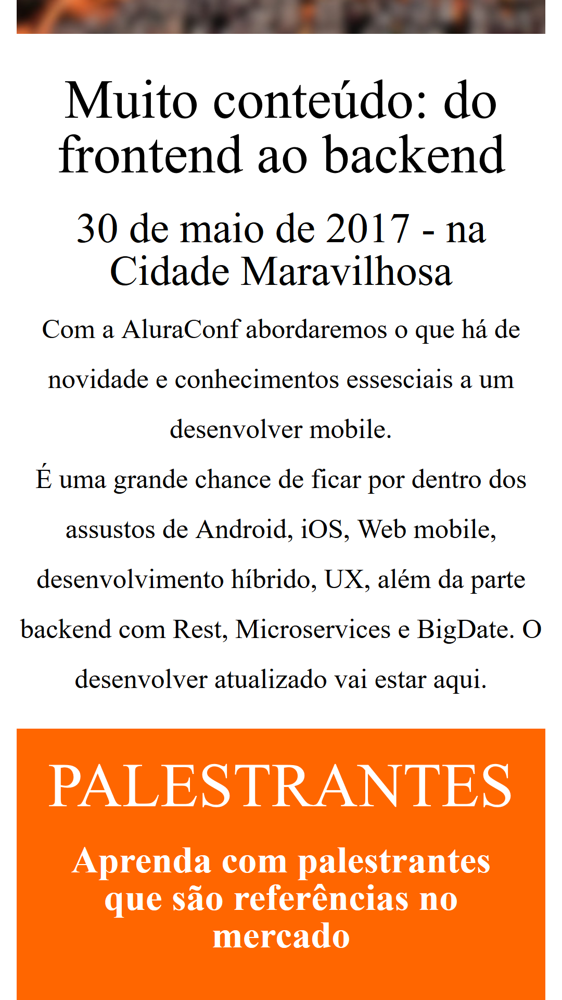
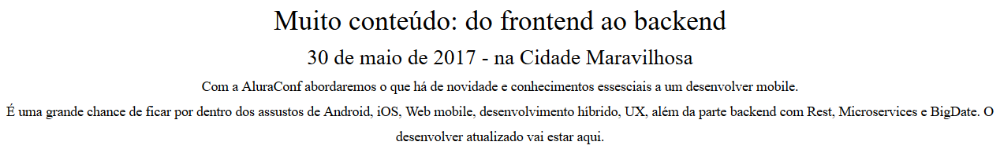
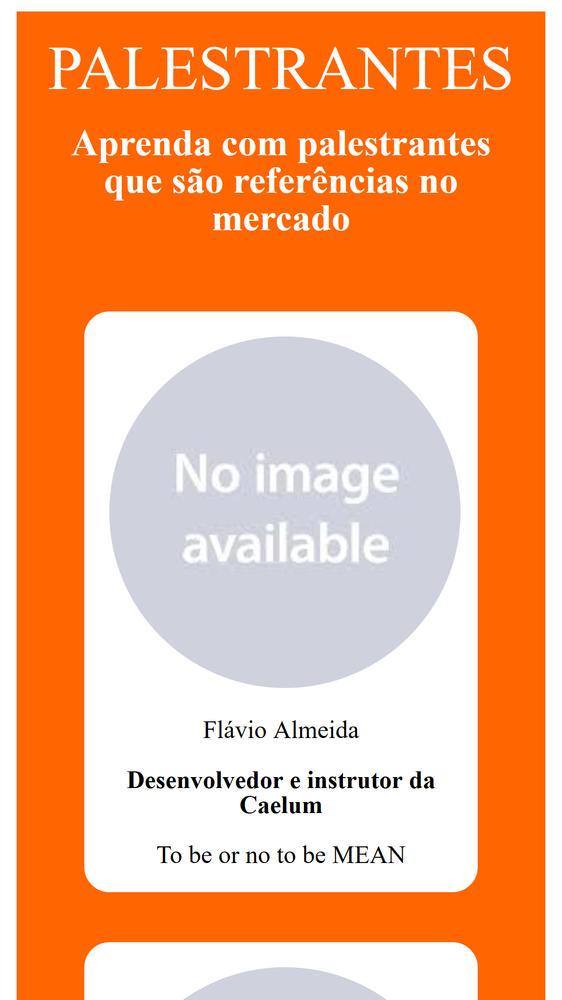
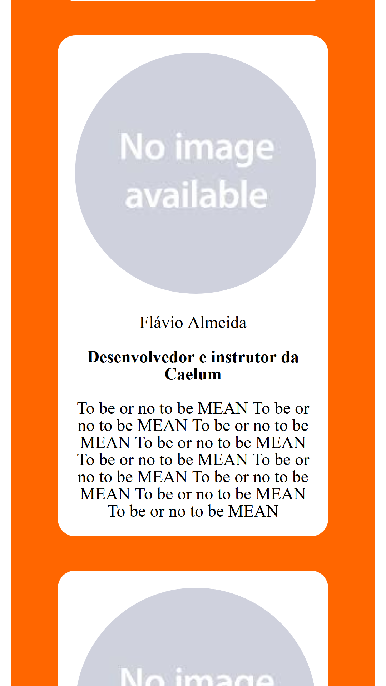
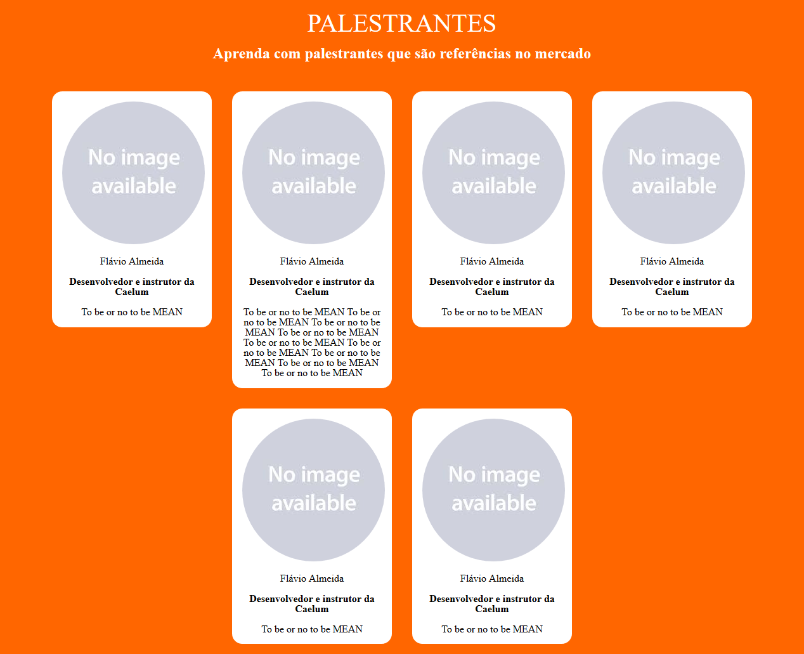
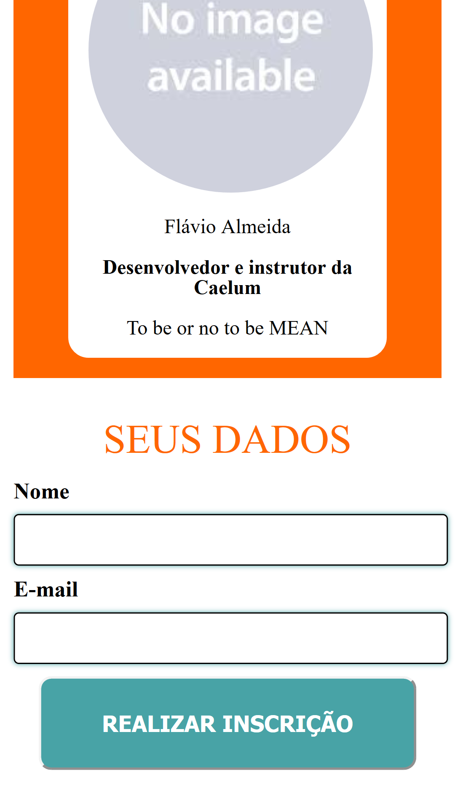
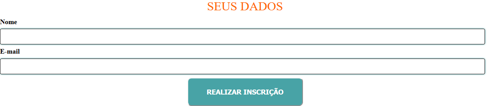

# Projeto Front End Alura

Projeto de conclusão para testar os conhecimentos obtidos até então nos cursos de front-end da Alura.

Página responsiva, desenvolvida primeiro com foco em mobile (mobile-first), e depois adaptando para o desktop. O layout é responsivo para telas entre 320px até 1400px, com um breakpoint em 700px.

<h2>Header</h2>

<h3>Mobile:</h3>

<h3>Desktop:</h3>

<h2>Chamada</h2>

<h3>Mobile:</h3>

<h3>Desktop:</h3>

<h2>Palestrantes</h2>

<h3>Mobile:</h3>

<h3>Desktop:</h3>

<h2>Formulário</h2>

<h3>Mobile:</h3>

<h3>Desktop:</h3>
